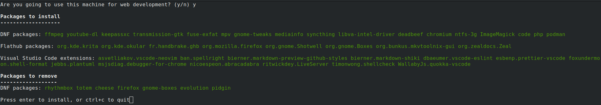
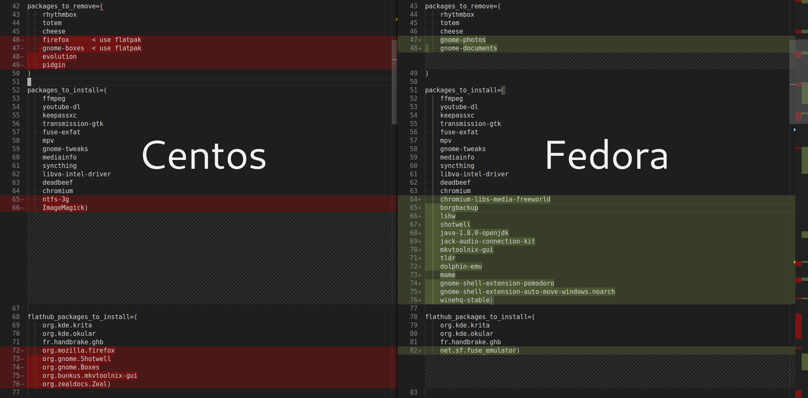

# Fedora and Centos Ultimate Setup Scripts v5 (May 2020)

**Welcome to your new ultimate desktop!** You can now choose between long term support with Centos and cutting edge features with Fedora. Run these scripts after a fresh install of your favorite OS. You can re-create the same set of applications and settings across both distributions. Enjoy:

### Browsers

- Firefox
- Chromium

### Graphics and photography

- Krita
- Shotwell
- ImageMagick

### Sound and video

- Deadbeef
- MPV
- Handbrake
- MKVToolNix

### Security and backup

- KeepassXC
- Syncthing
- BorgBackup

### (Optional) Development tools

- Visual Studio Code with extensions
- PHP / Node.js / Deno
- Podman (Centos) / Docker (Fedora)
- Boxes

There are two scripts for each distribution, `install` and `setup`. Install requires running with `sudo`, this was done to prevent it timing out when left unattended.

## Install script



You will be prompted for a choice between standard install and web development install. These are both highly opinionated, but simple to change editing the scripts:

```shell
# >>>>>> start of user settings <<<<<<
Add and remove the applications you want from repositories
# >>>>>> end of user settings <<<<<<

# Repositories are intelligently added for your choices if needed:
case " ${packages_to_install[*]} " in
*' code '*)
    # Action if 'code' is included in packages
    ;;&
*' brave-browser '*)
    # Action if 'brave-browser' is included in packages
    ;;
esac

# If web development is chosen additional actions can be performed other than adding more packages
if [[ $webdev =~ ^[Yy]$ ]]; then
    # Additional actions
fi
```

## Setup script

If web development was chosen then a lot of extra things are setup here, including my entire config for Visual Studio Code. Most people will want to heavily edit this file for their own preferences. Highlights include:

- Better Gnome settings
- Set your Github name and email
- PHP settings
- Set host name
- Write config files only for software that you have installed previously
- Improve Pulse Audio defaults
- Subpixel rendering for Xorg
- Various fixes and enhancements

# New in version 5:

- Tested on Fedora 32 and Centos 8.1
- Add new apps and remove old ones
- Synchronize Fedora and Centos application versions as much as possible taking advantage of newly available EPEL-8 and Flatpak packages. Always prefer official repository versions where possible.



- Add option to auto start programs on boot using `.config/autostart` with a default `TODO.txt` list and terminal instance
- Add updated compatible `abattis cantarell fonts` for Centos 8.1, it ships with old ones
- Refactor, update and improve all scripts

## Fedora Installation and running scripts

Download this repository using git, CD into the directory, and run:

```
git clone https://github.com/David-Else/fedora-ultimate-setup-script
cd fedora-ultimate-setup-script
sudo ./fedora-ultimate-install-script.sh
./fedora-ultimate-setup-script.sh
```

## Centos 8 Installation and running scripts

Download this repository using git, CD into the directory, and run:

```
git clone https://github.com/David-Else/fedora-ultimate-setup-script
cd fedora-ultimate-setup-script
sudo ./centos8-ultimate-install-script.sh
./centos8-ultimate-setup-script.sh
```

### FAQ

**Q**: Does this script disable the caps lock key? I've noticed that it works during login but after that it stops working altogether.

**A**: It makes the caps lock into a delete for touch typing purposes, to change it modify this line before running:

```shell
 capslock_delete="false"
```
